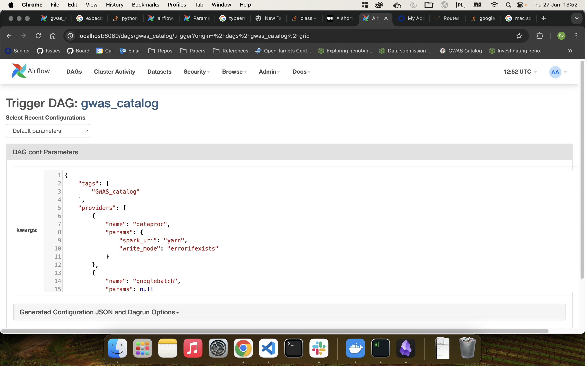

# How to set up the repository

## Requirements:

-[x] pyenv -[x] poetry -[x] python3.10 -[x] docker -[x] docker-compose -[x] poetry-plugin-export

initialize the project with:

```
make dev
```
The above command checks if correct python is available through `pyenv`. Checks if poetry is present,
sets up poetry project and builds the airflow container.

The orchestration uses the Airflow container that is set up by the `docker-compose`. To build the image standalone
run

```
make build-airflow-image
```

The requirements for setting up google cloud project are the same as for the gentropy

- [x] set up google service account
- [x] change the user to match your `id -u` in the `.env` file

The airflow DAGs sit in the `orchestration` package inside the `dags` directory.
The configuration for the DAGs is located in the `orchestration` package inside the `configs` directory.

In order to run the airflow rin the

```
docker-compose up
```

and open `localhost:8080` on your local machine.

Currently the dag(s) are under heavy development, so there can be issues while airflow tries to parse them.
Current development focuses on unification of the `gwas_catalog_*` dags in `gwas_catalog_dag.py` file in a single DAG.
To be able to run it one need to provide the configuration from the `configs/config.json` to the dag trigger as in the exaple picture.


