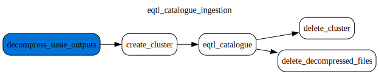

# EQTL Catalogue

This document was updated on 2024-10-14

This datasource is currently fixed under the [eQTL Catalogue Release 7 - June 2024](https://www.ebi.ac.uk/eqtl/Release_notes/#:~:text=eQTL%20Catalogue%20release%207%20%2D%20June%202024)

Data source comes from the `https://www.ebi.ac.uk/eqtl/`

Data stored under `gs://eqtl_catalogue_data` bucket comes with following structure

```
gs://eqtl_catalogue_data/credible_set_datasets/
gs://eqtl_catalogue_data/docs/
gs://eqtl_catalogue_data/ebi_ftp/susie/
gs://eqtl_catalogue_data/otar2077/
gs://eqtl_catalogue_data/study_index/
gs://eqtl_catalogue_data/study_locus_datasets/
```

## Preprocessing

> [!Warning]
> Initially the _eqtl summary statistics_ were harmonised by the gentropy and finemapped with pics - see https://github.com/opentargets/gentropy/pull/238. The results of that finemapping can be found in `gs://eqtl_catalogue_data/study_locus_datasets/` and `gs://eqtl_catalogue_data/credible_set_datasets/eqtl_catalog_picsed/`
> This approach was changed to SuSIE finemapping results are ingested as the source of the `credible sets` - see https://github.com/opentargets/issues/issues/3235.

To run the ingestion of the finemapping results, the gzipped tsv files need's to be fetched from the `https://ftp.ebi.ac.uk/pub/databases/spot/eQTL/susie/` have to be downloaded. These are stored under the `gs://eqtl_catalogue_data/ebi_ftp/susie`.

## Processing description

### eqtl_catalogue_ingestion dag

The **qetl_catalogue_ingestion.py** dag contains following steps:



The dag consists of 3 steps:

1. Decompress susie results (job running by `google DataFlow`)
2. Run eqtl_catalogue step to create a . Step running on dataproc - to see the reference check - [eqtl_catalogue step](https://opentargets.github.io/gentropy/python_api/steps/eqtl_catalogue/)
3. Delete decompressed files.

The output datasets from the dataproc job are:

- [x] [`StudyIndex`](https://opentargets.github.io/gentropy/python_api/datasets/study_index/) stored under `gs://eqtl_catalogue_data/study_index/`
- [x] [`CredibleSets`](https://opentargets.github.io/gentropy/python_api/datasets/study_locus/) stored under `gs://eqtl_catalogue_data/credible_set_datasets/eqtl_catalogue_susie/`

The configuration of the dataproc infrastructure and individual step parameters can be found in `eqtl_catalogue_ingestion.yaml` file.
