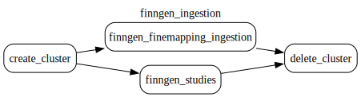

# Finngen

This document was updated on 2024-10-15

This datasource is currently fixed under [Finngen Data Freeze 11 - June 24 2024](https://www.finngen.fi/en/access_results#:~:text=LATEST%20RELEASE%3A-,DF11%20%2D%20June%2024%202024,-Total%20sample%20size)

Data source comes from the bucket `gs://finngen-public-data-r11/` hosted by Finngen.

Data is stored under `gs://finngen_data/r11` comes with following structure

```
gs://finngen_data/r11/credible_set_datasets/susie
gs://finngen_data/r11/study_index/
```

## Preprocessing

Raw data is fetched by the gentropy steps directly from the data source. No preprocessing steps are required.

The fetching paths are:

- snp files from `gs://finngen-public-data-r11/finemap/full/susie/*.snp.bgz`
- credible_set files from `gs://finngen-public-data-r11/finemap/summary/*_99.cred.summary.tsv`

## Processing description

### finngen_ingestion dag

The **finngen_ingestion.py** dag contains following steps:



The dag consists of 2 steps:

1. finngen_studies - Step that creates the StudyIndex dataset
2. finngen_finemapping_ingestion - Step that ingests the SuSiE finemapping results from Finngen datasource to CredibleSet dataset.

Steps run in parallel in the dataproc cluster.

The output datasets are:

- [x] [`StudyIndex`](https://opentargets.github.io/gentropy/python_api/datasets/study_index/) stored under `gs://finngen_data/r11/study_index/`
- [x] [`CredibleSets`](https://opentargets.github.io/gentropy/python_api/datasets/study_locus/) stored under `gs://finngen_data/r11/credible_set_datasets/susie/`

The configuration of the dataproc infrastructure and individual step parameters can be found in `finngen_ingestion.yaml` file.
