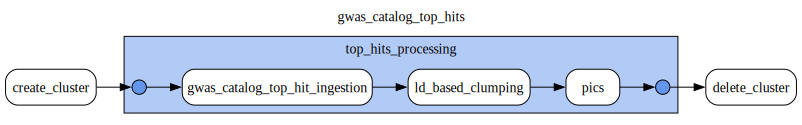
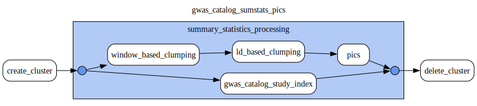
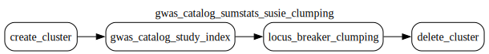
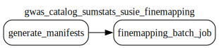

# GWAS Catalog data source

This document was updated on 2024-10-18

Data stored under 4 buckets:

- `gs://gwas_catalog_inputs`
- `gs://gwas_catalog_sumstats_pics`
- `gs://gwas_catalog_sumstats_susie`
- `gs://gwas_catalog_top_hits`

## GWAS Catalog inputs

Bucket `gs://gwas_catalog_inputs` contains:

```
gs://gwas_catalog_inputs/gwas_catalog_associations_ontology_annotated.tsv
gs://gwas_catalog_inputs/gwas_catalog_download_ancestries.tsv
gs://gwas_catalog_inputs/gwas_catalog_download_studies.tsv
gs://gwas_catalog_inputs/harmonisation_manifest.csv
gs://gwas_catalog_inputs/harmonisation_summary/
gs://gwas_catalog_inputs/harmonised_summary_statistics/
gs://gwas_catalog_inputs/raw_summary_statistics/
gs://gwas_catalog_inputs/summary_statistics_qc/
gs://gwas_catalog_inputs/statistics/
```

### raw_summary_statistics

This directory contains summary statistics in the form of harmonised (by GWAS Catalog) gzipped tsv files that are synced directly from the [GWAS Catalog FTP server](https://ftp.ebi.ac.uk/pub/databases/gwas/summary_statistics/) by a cron job.

### harmonised_summary_statistics

This directory contains outputs from the Open Targets inhouse ETL harmonisation process described in [GWAS Catalog harmonisation dag](https://github.com/opentargets/orchestration/blob/dev/src/ot_orchestration/dags/gwas_catalog_sumstat_harmonisation.py). The result is the [SummaryStatistics dataset](https://opentargets.github.io/gentropy/python_api/datasets/summary_statistics/) saved in parquet format per summary statistics input file.

### summary_statistics_qc

This directory contains outputs from the Open Targets inhouse ETL harmonisation process described in [GWAS Catalog harmonisation dag](https://github.com/opentargets/orchestration/blob/dev/src/ot_orchestration/dags/gwas_catalog_sumstat_harmonisation.py). The result is the [summary statistics QC dataset](https://github.com/opentargets/gentropy/blob/dev/src/gentropy/sumstat_qc_step.py) saved in the csv format per summary statistics input file.

### harmonisation_manifest.csv

The `harmonisation_manifest.csv` is the file that is generated before the harmonisation is performed. This is the input file to all google batch jobs that are used to perform Harmonisation and Quality Checks on raw summary statistics. Each row of the manifest represents a single GWAS Catalog study.

The file describes following fields:

- study - study identifier
- rawSumstatPath - input path for the harmonisation
- harmonisedSumstatPath - output path of the harmonised study
- qcPath - output path of the qc results performed on the harmonised study
- isHarmonised - boolean flag depicting if the `harmonisedSumstatPath` has been found
- qcPerformed - boolean flag depicting if the `qcPath` has been found

The manifest file gets generated each time the harmonisation dag is triggered and the manifest get's updated with the up-to-date state of the staging bucket.

As the QC step can fail without producing any meaningful metrics (the most common reason is due to empty harmonised summary statistics parquet), the study that fails the QC is considered
as failing.

> [!NOTE]
> Rescuing these summary statistics that fail to produce a QC output currently has to be done manually. This can be achieved with deep look into the `harmonisation logs and individual study summaries`. See the `harmonisation_summary` for more details.

<details>
  <summary>Expand to see the example of manifest file</summary>

```
rawSumstatPath,study,harmonisedSumstatPath,isHarmonised,qcPath,qcPerformed
gs://gwas_catalog_inputs/raw_summary_statistics/GCST000001-GCST001000/GCST000028/harmonised/17463246-GCST000028-EFO_0001360.h.tsv.gz,GCST000028,gs://gwas_catalog_inputs/harmonised_summary_statistics/GCST000028/,True,gs://gwas_catalog_inputs/summary_statistics_qc/GCST000028/,True
```

</details>

### harmonisation_summary

This is the dataset containing meta information about the status of finemapping. This directory contains per summary statistics file metrics in two files:

- harmonisation_summary (harmonisation.csv)
- harmonisation_log (harmonisation.log)

The files are stored under the per study directory in the form like below:

```
gs://gwas_catalog_inputs/harmonisation_summary/GCST90077749/202410141529/harmonisation.csv
gs://gwas_catalog_inputs/harmonisation_summary/GCST90077749/202410141529/harmonisation.log
gs://gwas_catalog_inputs/harmonisation_summary/GCST90077749/latest/harmonisation.csv
gs://gwas_catalog_inputs/harmonisation_summary/GCST90077749/latest/harmonisation.log
```

inside the `dated` and `latest` subdirectories, so subsequent harmonisation runs do not overwrite the existing information.

#### harmonisation.csv

This is the result of the harmonisation script metadata collection.

The file reports following metrics:

- study - study identifier
- harmonisationExitCode - the return value of the harmonisation spark job performed during the harmonisation script execution. Can be 0 or int, in case it's not 0, this metrics reports that harmonisation task failed for this study.
- qcExitCode - the return value of the qc spark job performed during the harmonisation script execution. Can be 0 or int, in case it's not 0, this metrics reports that qc task failed for this study.
- rawSumstatFile - input to the harmonisation
- rawSumstatFileSize - size of the raw file before unzipping
- rawUnzippedSumstatFileSize - size of the raw file after unzipping - if this metric is empty, this could mean that the unzipping produced too big file to handle for the google batch task executor resulting in job failure.

<details>
  <summary>Expand to see the example</summary>

```
study,harmonisationExitCode,qcExitCode,rawSumstatFile,rawSumstatFileSize,rawUnzippedSumstatFileSize
GCST90077749,0,1,gs://gwas_catalog_inputs/raw_summary_statistics/GCST90077001-GCST90078000/GCST90077749/harmonised/34662886-GCST90077749-EFO_1001919.h.tsv.gz,18M,62M
```

</details>

#### harmonisation.log

This file contains logs from the harmonisation script collected during it's execution. In case of any issues found in the `harmonisation.csv`, the best way to uncover what happened is to see directly into this file content and look for the `Error` or `Exception`. This file contains entire configuration as well as all the error logs.

<details>
  <summary>Expand to see the example</summary>

```
[2024.10.14 15:33] Copying raw summary statistics from gs://gwas_catalog_inputs/raw_summary_statistics/GCST90078001-GCST90079000/GCST90079000/harmonised/GCST90079000.h.tsv.gz to GCST90079000.h.tsv.gz
[2024.10.14 15:34] Raw file size 17M
[2024.10.14 15:34] Unzipping GCST90079000.h.tsv.gz to GCST90079000.h.tsv
[2024.10.14 15:34] Unzipped file size 74M
[2024.10.14 15:34] Running harmonisation on GCST90079000.h.tsv file
Setting default log level to "WARN".
To adjust logging level use sc.setLogLevel(newLevel). For SparkR, use setLogLevel(newLevel).
24/10/14 15:34:18 WARN NativeCodeLoader: Unable to load native-hadoop library for your platform... using builtin-java classes where applicable
step:
  session:
    start_hail: false
    write_mode: overwrite
    spark_uri: local[*]
    hail_home: /app/.venv/lib/python3.10/site-packages/hail
    extended_spark_conf:
      spark.jars: https://storage.googleapis.com/hadoop-lib/gcs/gcs-connector-hadoop3-latest.jar
      spark.dynamicAllocation.enabled: 'False'
      spark.driver.memory: 16g
      spark.kryoserializer.buffer.max: 500m
      spark.driver.maxResultSize: 5g
    _target_: gentropy.common.session.Session
  raw_sumstats_path: GCST90079000.h.tsv
  out_sumstats_path: gs://gwas_catalog_inputs/harmonised_summary_statistics/GCST90079000/
  _target_: gentropy.gwas_catalog_sumstat_preprocess.GWASCatalogSumstatsPreprocessStep
datasets: {}

[2024-10-14 15:34:57,389][py4j.clientserver][INFO] - Closing down clientserver connection
[2024.10.14 15:34] Harmonisation exit code: 0
[2024.10.14 15:34] Running qc on gs://gwas*catalog_inputs/harmonised_summary_statistics/GCST90079000/ file
Setting default log level to "WARN".
To adjust logging level use sc.setLogLevel(newLevel). For SparkR, use setLogLevel(newLevel).
24/10/14 15:35:07 WARN NativeCodeLoader: Unable to load native-hadoop library for your platform... using builtin-java classes where applicable
step:
session:
start_hail: false
write_mode: overwrite
spark_uri: local[*]
hail_home: /app/.venv/lib/python3.10/site-packages/hail
extended_spark_conf:
spark.jars: https://storage.googleapis.com/hadoop-lib/gcs/gcs-connector-hadoop3-latest.jar
spark.dynamicAllocation.enabled: 'False'
spark.driver.memory: 16g
spark.kryoserializer.buffer.max: 500m
spark.driver.maxResultSize: 5g
\_target*: gentropy.common.session.Session
gwas*path: gs://gwas_catalog_inputs/harmonised_summary_statistics/GCST90079000/
output_path: gs://gwas_catalog_inputs/summary_statistics_qc/GCST90079000/
pval_threshold: 1.0e-08
\_target*: gentropy.sumstat_qc_step.SummaryStatisticsQCStep
datasets: {}

[2024-10-14 15:35:53,153][py4j.clientserver][INFO] - Closing down clientserver connection
[2024.10.14 15:35] QC exit code: 0

```

</details>

### statistics

This directory contains various analysis performed on harmonisation results.

## GWAS Catalog top hits

Bucket `gs://gwas_catalog_top_hits` contains:

```
gs://gwas_catalog_top_hits/credible_sets/
gs://gwas_catalog_top_hits/study_index/
gs://gwas_catalog_top_hits/study_locus_ld_clumped/
gs://gwas_catalog_top_hits/study_locus_window_based_clumped/
```

Data contained in the `top_hits` corresponds to the [GWAS Catalog top associations](https://www.ebi.ac.uk/gwas/docs/methods/criteria#:~:text=statistics%20here.-,Top%20associations,-We%20also%20report)

Data is produced by **gwas_catalog_top_hits DAG**. The dag configuration and topology can be found in `gwas_catalog_top_hits.yaml` file under the config directory.

DAG contains 3 steps:



1. gwas_catalog_top_hits_ingestion
2. ld_based_clumping
3. pics

### gwas_catalog_top_hits_ingestion

The step runs on the dataproc cluster that is used to generate the [study_index dataset](https://opentargets.github.io/gentropy/python_api/datasets/study_index/) and perform [window_based_clumping](https://opentargets.github.io/gentropy/python_api/methods/clumping/) on top associations. The datasets are saved under `gs://gwas_catalog_top_hits/study_index/` and `gs://gwas_catalog_top_hits/study_locus_window_based_clumped/`.

### ld_based_clumping

The step that performs [ld_clumping](https://opentargets.github.io/gentropy/python_api/methods/clumping/) on the results from the previous step. The results from this step are saved under `gs://gwas_catalog_top_hits/study_locus_ld_clumped/`.

### pics

The step that performs [PICS finemapping](https://opentargets.github.io/gentropy/python_api/methods/pics/) based on the ld clumped study locus dataset to obtain the dataset containing credible sets. This dataset is stored under `gs://gwas_catalog_top_hits/credible_sets/`

## GWAS Catalog pics summary statistics

Bucket `gs://gwas_catalog_sumstats_pics` contains:

```
gs://gwas_catalog_sumstats_pics/credible_sets/
gs://gwas_catalog_sumstats_pics/study_index/
gs://gwas_catalog_sumstats_pics/study_locus_ld_clumped/
gs://gwas_catalog_sumstats_pics/study_locus_window_based_clumped/
```

Data contained in the `pics summary statistics` corresponds to the GWAS Catalog summary statistics harmonised to the Open Targets [SummaryStatistics dataset](https://opentargets.github.io/gentropy/python_api/datasets/summary_statistics/).

Data is produced by **gwas_catalog_sumstats_pics DAG**. The dag configuration and topology can be found in `gwas_catalog_sumstats_pics.yaml` file under the config directory.

DAG contains 4 steps:



1. gwas_catalog_study_index
2. window_based_clumping
3. ld_based_clumping
4. pics

### gwas_catalog_study_index

The step runs on the dataproc cluster that is used to generate the [study_index dataset](https://opentargets.github.io/gentropy/python_api/datasets/study_index/) that is saved under the `gs://gwas_catalog_sumstats_pics/study_index/`

### window_based_clumping

The step that performs the [window_based_clumping](https://opentargets.github.io/gentropy/python_api/methods/clumping/) on harmonised summary statistics. The dataset is saved under `gs://gs://gwas_catalog_sumstats_pics/study_locus_ld_clumped/`.

### ld_based_clumping

The step that performs [ld_clumping](https://opentargets.github.io/gentropy/python_api/methods/clumping/) on the results from window based clumping step. The results from this step are saved under `gs://gwas_catalog_top_hits/study_locus_ld_clumped/`.

### pics

The step that performs [PICS finemapping](https://opentargets.github.io/gentropy/python_api/methods/pics/) based on the ld clumped study locus dataset to obtain the dataset containing credible sets. This dataset is stored under `gs://gwas_catalog_sumstats_pics/credible_sets/`

## GWAS Catalog susie summary statistics

Bucket `gs://gwas_catalog_sumstats_susie` contains:

```
gs://gwas_catalog_sumstats_susie/credible_set_datasets/
gs://gwas_catalog_sumstats_susie/finemapping_logs/
gs://gwas_catalog_sumstats_susie/finemapping_manifests/
gs://gwas_catalog_sumstats_susie/study_index/
gs://gwas_catalog_sumstats_susie/study_locus_lb_clumped/
```

Data is produced by 2 dags:

- **gwas_catalog_sumstats_susie_clumping**



### gwas_catalog_study_index

The step runs on the dataproc cluster that is used to generate the [study_index dataset](https://opentargets.github.io/gentropy/python_api/datasets/study_index/) that is saved under the `gs://gwas_catalog_sumstats_susie/study_index/`.

This step requires following resources to reason about the inclusion or exclusion of the
gwas studies that were harmonised.

- harmonisation qc results
- manual curation of the gwas studies (not provided by default)

The reasoning is captured in the study index metadata fields.

### locus_breaker_clumping

This process performs locus clumping on previously harmonised summary statistics and results in [StudyLocus](https://opentargets.github.io/gentropy/python_api/datasets/study_locus/) dataset stored under `gs://gwas_catalog_sumstats_susie/study_locus_lb_clumped`.

- **gwas_catalog_sumstats_susie_finemapping**



This dag performs fine mapping with SuSiE-inf algorithm on clumped study loci to obtain [Credible sets](https://opentargets.github.io/gentropy/python_api/datasets/study_locus/). This is expensive process and is run on google batch.

Due to infrastructure, the fine mapping process is divided into a 2-step logic:

- [x] Generate manifests - `FinemappingBatchJobManifestOperator`
- [x] Execute Finemapping batch job (finemapping step per each manifest) - `FinemappingBatchOperator`

1. Tasks performed by `FinemappingBatchJobManifestOperator`

- Collect all individual loci parquet files
- Partition collected loci into batches with with `max_records_per_chunk` as a limit of the batch size.
- For each batch create a manifest file that will be imputed to the fine mapping gentropy step
- Save the batch manifests to google cloud storage.

2. Tasks performed by `FinemappingBatchOperator`

- Execute one google batch job per manifest with `n <= max_records_per_chunk` tasks.
- Each task executes finemapping step on single `StudyLocus` record.

> [!WARNING]
> For the GWAS Catalog sumstats susie dataset the number of tasks can not exceed 40k due to the
> size of the environment payload that is send to each batch task.
> `400 Request payload size exceeds the limit: 10485760 bytes`

3. Collect logs

The output of finemapping can be found under the:

- `gs://gwas_catalog_sumstats_susie/credible_set_datasets/` - fine mapped study loci
- `gs://gwas_catalog_sumstats_susie/finemapping_manifests/` - manifests used during the fine mapping job
- `gs://gwas_catalog_sumstats_susie/finemapping_logs/` - logs from the individual finemapping tasks

#### Parametrization of google batch finemapping job

The configuration of the google batch infrastructure and individual step parameters can be found in `gwas_catalog_sumstats_susie_finemapping.yaml` file.
To adjust the parameters for google batch infrastructure refer to the `google_batch` block in the node configuration.

> [!WARNING]
> After running the google batch fine mapping job, ensure that the job tasks have succeeded, otherwise the job requires manual curation.
