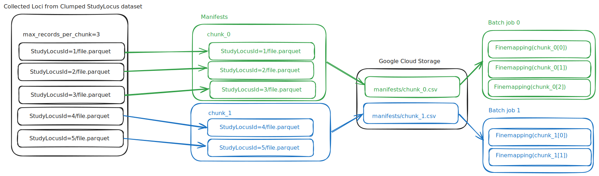

# UK Biobank Pharma Proteomics Project (UKB-PPP)

This document was updated on 2024-10-11

Data source comes from the `https://registry.opendata.aws/ukbppp/`

Data stored under `gs://ukb_ppp_eur_data` bucket comes with following structure

```
gs://ukb_ppp_eur_data/finemapping_manifests/
gs://ukb_ppp_eur_data/harmonised_summary_statistics/
gs://ukb_ppp_eur_data/study_index/
gs://ukb_ppp_eur_data/study_locus_lb_clumped/
gs://ukb_ppp_eur_data/test/
```

## Processing description

## Pre-steps

Full description of the process can be found in https://github.com/opentargets/issues/issues/3234

### 1. Mirror

- **Input.** Original data is hosted on Synapse.
- **Transformation.**
  - As we decided in the past, we want to keep the copy of the original data in the Vault.
  - Protocol is available here: https://github.com/opentargets/gentropy-vault/blob/main/datasets/ukb-ppp.md.
  - The protocol must be run manually.
- **Output.** The output of this step is kept forever in the Vault.

### 2. Preprocess

- **Input.** The mirrored data from the previous step.
- **Transformation.**
  - The data which we mirrored during the previous steps has to undergo several specific transformations which aren't achievable in Spark (especially the first one):
    - Extract gzipped per-chromosome files from inside the individual TAR files, decompress, partition by chromosome
    - Recreate the study ID. This is required because multiple rows in the study index can reuse the same summary stats file
    - Drop certain rows which don't have a corresponding summary stats file
  - This transformation is done using Google Batch. The code can be found in this new repository: https://github.com/opentargets/gentropy-input-support. The UKB PPP-specific part is this one: https://github.com/opentargets/gentropy-input-support/blob/dc5f8f7aee13a066933f3fd5b18a9b3a5ca71069/data_sources.py#L43-L103.
  - The command to run is `./submit.py ukb_ppp_eur` inside the `gentropy-input-support`
  - This step must also be triggered manually, how to do this is described in the repository.
- **Output.** Precursors of study index and summary stats datasets are output. Because we decided that we don't want to keep the data twice, the output of this step is only kept temporarily and is deleted after 60 days according to the _gs://gentropy-tmp_ bucket lifecycle rules.

## Orchestration steps

### ukb_ppp_eur_harmonisation dag

**Harmonisation dag** contains two steps:

- raw sumstat preprocessing (ukb_ppp_eur_sumstat_preprocess)
- locus breaker clumping (locus_breaker_clumping)

The configuration of the dataproc infrastructure and individual step parameters can be found in `ukb_ppp_eur_harmonisation.yaml` file.

#### ukb_ppp_eur_sumstat_preprocess

This process **harmonizes the raw pre-processed data** to the [SummaryStatistics](https://opentargets.github.io/gentropy/python_api/datasets/summary_statistics/) and creates the [StudyIndex](https://opentargets.github.io/gentropy/python_api/datasets/study_index/).

The outputs are stored in:

- `gs://ukb_ppp_eur_data/study_index` - study index
- `gs://ukb_ppp_eur_data/harmonised_summary_statistics` - summary statistics

### locus_breaker_clumping

This process performs locus clumping on previously harmonised summary statistics and results in [StudyLocus](https://opentargets.github.io/gentropy/python_api/datasets/study_locus/) dataset stored under `gs://ukb_ppp_eur_data/study_locus_lb_clumped`

### ukb_ppp_eur_finemapping dag

This dag performs fine mapping with SuSiE-inf algorithm on clumped study loci to obtain [Credible sets](https://opentargets.github.io/gentropy/python_api/datasets/study_locus/). This is expensive process and is run on google batch.

Due to infrastructure, the fine mapping process is divided into a 2-step logic:

- [x] Create input manifests - `FinemappingBatchJobManifestOperator`
- [x] Execute Finemapping step for each manifest - `FinemappingBatchOperator`



1. Tasks performed by `FinemappingBatchJobManifestOperator`

- Collect all individual loci parquet files
- Partition collected loci into batches with with `max_records_per_chunk` as a limit of the batch size.
- For each batch create a manifest file that will be imputed to the fine mapping gentropy step
- Save the batch manifests to google cloud storage.

2. Tasks performed by `FinemappingBatchOperator`

- Execute one google batch job per manifest with `n <= max_records_per_chunk` tasks.
- Each task executes finemapping step on single `StudyLocus` record.

The output of finemapping can be found under the:

- `gs://ukb_ppp_eur_data/credible_set_datasets/` - fine mapped study loci
- `gs://ukb_ppp_eur_data/finemapping_manifests/` - manifests used during the fine mapping job

#### Parametrization of google batch finemapping job

The configuration of the google batch infrastructure and individual step parameters can be found in `ukb_ppp_eur_finemapping.yaml` file.
To adjust the parameters for google batch infrastructure refer to the `google_batch` block in the node configuration.

> [!WARNING]
> After running the google batch fine mapping job, ensure that the job tasks have succeeded, otherwise the job requires manual curation.
